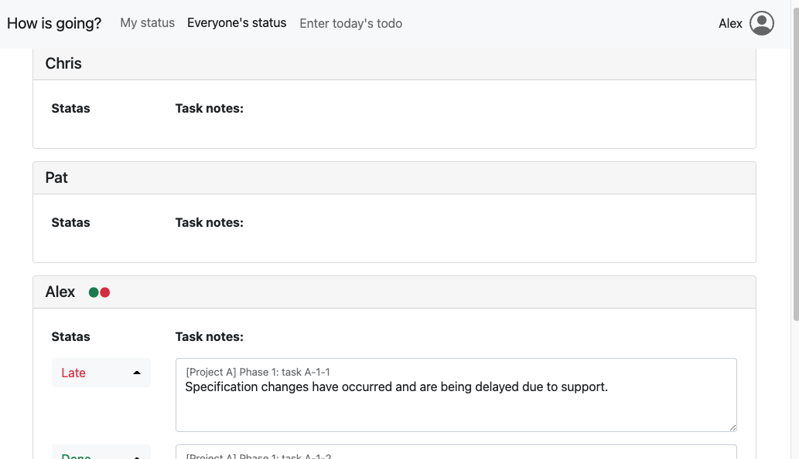

# README

## What is going?

It is a progress sharing system for web servers where PHP runs in-house.
Features include: 

- **Php works if there is a working web server**. 
- The database uses Sqlite3 and does **not require the installation of DBMS separately**. 
- It is not suitable for use on public servers because it is **not security-conscious**. 
- There is a screen to check the progress of the entire team and a screen to check and input the progress of individuals, and you can easily manage progress during the morning meeting and daytime. 
- **The number of tasks and the ramp representing the progress allow you to see your progress at a glance**. 
- **You can switch the display language automatically depending on the locale of the browser**. 
  Currently, we are available in Japanese and English. 
- Autosaves **3 seconds after entering progress and task notes**. 

## Screenshot 

- Enter tasks 
   
- Tracking
   
- Team progress list
  
  
## Unimplemented features 

- [ ] Delete tasks 
- [ ] Login function
