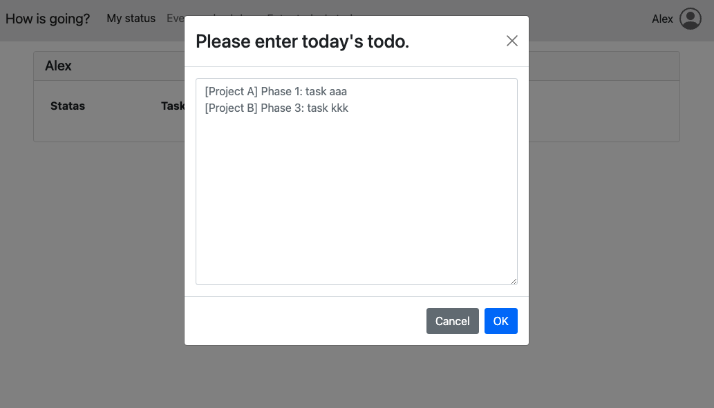
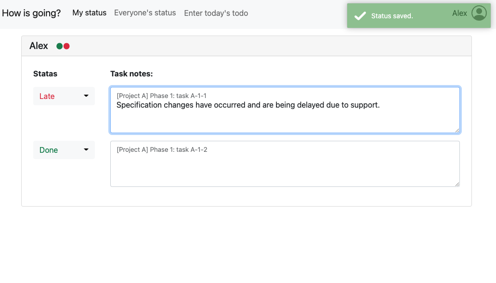
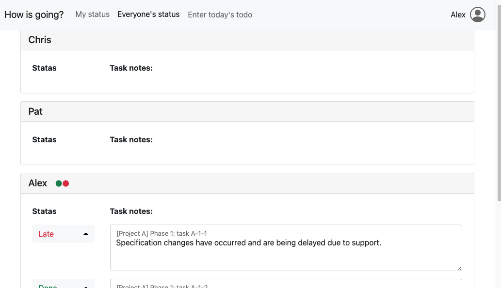

# README

[](LICENSE.md)
[](https://nodejs.org/ja/)
[](https://nodejs.org/ja/)


- [README 日本語版](README.ja.md)

## What is "How is going"?

It is a status sharing system for web servers where PHP runs in-house.
Features include: 

- **It works with a web server running PHP**.
- Sqlite3 is used as the database, **so there is no need to install a separate DBMS**.
- It is not suitable for use on a public server **because of its lack of security considerations**.
- There is a screen for checking the progress of the entire team and a screen for checking and entering individual progress, making it easy to manage progress in morning meetings and during the day.
- **The number of tasks and progress indicator lights allow you to see the degree of progress at a glance**.
- You can **automatically switch the display language according to the locale of your browser**. Currently, Japanese and English are supported.
- After you enter your progress or task notes, ~~**they will be automatically saved after 3 seconds**.~~ You can now view and edit past and future tasks as well.

## How to install

1. clone the repository.
2. copy it to the public directory of your web server.
3. edit `tools/initdb.php` to create a roster for the database.
4. create a Sqlite3 database file with the following command:
  ```sh
  cd /path/to/installed_dir/
  php tools/initdb.php
  ```

## Usage

1. Access the URL you installed.
1. When the user selection dialog box appears, select the user name you want to use. You can reselect it by clicking the icon in the upper right corner.
1. Click "Enter today's todo" on the navbar. The "Enter Task" dialog box will appear.
1. Enter a name for the task in the "Enter Task" dialog box. You can enter more than one name at a time, separated by a new line.
1. You can add more tasks for today by entering them again from the Task Entry dialog.
1. You can check the status of the tasks you have entered in the "My status" and "Everyone's status" screens. At this time, you can only edit the status of your own tasks and notes.
1. Only your own task status and notes will be automatically saved 3 seconds after you stop typing.
1. You can only see today's tasks.

## Screenshot 

- Enter tasks 
   
- Tracking
   
- Team status list
  
  
## Unimplemented features 

- [x] Delete tasks 
- [ ] Login function
- [x] History reference function

Translated with www.DeepL.com/Translator (free version)
